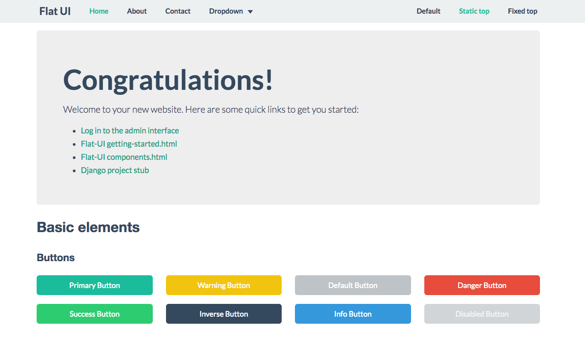

# Features

 - Flat-UI templates
 - Django Registration
 - Authentication with username and password
 - Celery integration
 - Sentry integration
 - Debug toolbar and Django extensions
 - Docker build ready
 - Dokku / Heroku deploy ready
 - PyTest integration
 - Selenium tests integration
 - Travis CI integration
 - Code style checkers (pep8, pylint, flake8, ...) by prospector
 - Redis and Postgres integration
 - Reversion and Simple-History integration

# HowTo Use #

Backend requirements:

  1. install `pip` -- https://pip.pypa.io/en/stable/installing/#installation
  1. install `virtualenv` -- https://virtualenv.pypa.io/en/stable/installation/#installation
  1. install `virtualenvwrapper` -- https://virtualenvwrapper.readthedocs.io/en/latest/install.html#installation (`pip install virtualenvwrapper`)
  1. install and run `PostgreSQL` and `Redis`
  1. install `PhantomJS` selenium driver (if you want to run selenium tests)

Frontend requirements:

  1. install `bower` -- https://bower.io/#install-bower (install `npm`, `node`, run `npm install -g bower`)

Create new project, virtualenv and install requirements:

    git clone https://github.com/pahaz/django-project-stub.git project-name
    cd project-name
    mkvirtualenv --python=$(which python3.5) project-name  # create virtualenv
    pip install -r requirements.txt  # install python requirements
    bower install  # install frontend requirements

Create file `settings_local.py` and setup DATABASE and some local settings:

      DEBUG = True
      SECRET_KEY = '0n-w7wsf^3-ehi^!@m2fayppf7cc3k4j5$2($59ai*5whm^l7k'
      DATABASES = {
          'default': {
              'ENGINE': 'django.db.backends.postgresql_psycopg2',
              'NAME': 'staff_pb',
              'USER': 'postgres',
              'PASSWORD': 'postgres',
              'HOST': 'localhost',
              'PORT': '5432'
          }
      }

Create and migrate database:

    createdb project-name  # create postgres database
    python manage.py migrate

Run dev server:

    python manage.py runserver

# Project structure #

 - [dir] `__data__` - project media data (`media` files, `db` files, `cache`, etc)
 - [dir] `_project_` - project level files
    - [dir] `./templates` - project common templates
    - [dir] `./static` - project common static files (js, css, img, etc)
    - [file] `./settings.py` - project settings
    - [file] `./urls.py` - project routs
 - [file] `requirements.txt` - project requirements
 - [file] `manage.py` - django manage file

# Tested #

OS: Windows/MacOS/Linux
Python: 3.5
